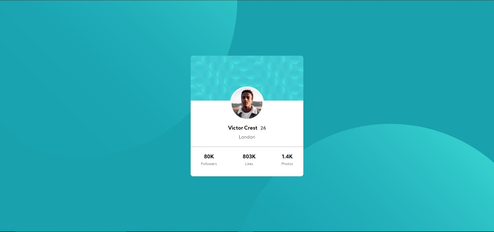

# Frontend Mentor - Profile card component solution

This is a solution to the [Profile card component challenge on Frontend Mentor](https://www.frontendmentor.io/challenges/profile-card-component-cfArpWshJ). Frontend Mentor challenges help you improve your coding skills by building realistic projects.

## Table of contents

- [Overview](#overview)
  - [The challenge](#the-challenge)
  - [Screenshot](#screenshot)
  - [Links](#links)
- [My process](#my-process)
  - [Built with](#built-with)
  - [What I learned](#what-i-learned)
- [Author](#author)

## Overview

### The challenge

- Build out the project to the designs provided

### Screenshot

### Links

- Solution URL: [https://www.frontendmentor.io/solutions/responsive-website-using-html-css-and-flexbox-eHlXnHpQF](https://www.frontendmentor.io/solutions/responsive-website-using-html-css-and-flexbox-eHlXnHpQF)
- Live Site URL: [https://saichandra2896.github.io/profile-card-component/](https://saichandra2896.github.io/profile-card-component/)

## My process

### Built with

- Semantic HTML5 markup
- CSS custom properties
- Flexbox

### What I learned

Positioning of background images. The card component does'nt shift with the width it stays constant in all the widths need to be carefull handling this in responsiveness. This project is a nice application of flexbox.

## Author

- Linked In - [@Sai Chandra](https://www.linkedin.com/in/sai-chandra-065101152/)
- Frontend Mentor - [@SaiChandra2896](https://www.frontendmentor.io/profile/SaiChandra2896)

## Acknowledgments

I would like to thank frontend mentor team for providing the challange and giving an oppurtunity to showcase the work.
